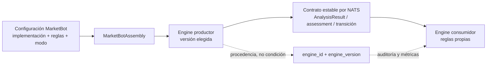
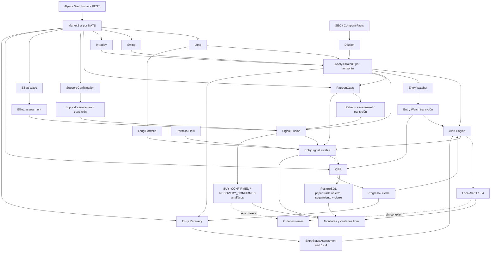

# Mapa de interconexiones y desacoplamiento

## Regla arquitectónica

Cada engine se construye con una versión de implementación y una versión de reglas elegidas en
`configs/marketbot/<version>.yaml`. Esas coordenadas pertenecen al engine. Los consumidores reciben
contratos estables por NATS y toman decisiones por horizonte, estado y capacidades publicadas;
nunca por `engine_id` o `engine_version`. Esos dos campos se conservan únicamente como procedencia
para auditoría, métricas y comparación de resultados.

## Flujo analítico y paper trades

No existe hoy un ejecutor de órdenes. `BUY_CONFIRMED`, `PATREON_CAPS_BUY` y las madureces L1-L4
son señales analíticas. Entry Opportunity las materializa como operaciones de papel en PostgreSQL,
actualiza su evolución con barras de un minuto y cierra cada leg para medir efectividad y ganancia
o pérdida. Un ejecutor futuro debe ser otro proceso, desactivado por defecto, que consuma un
contrato confirmado sin importar engines de análisis.

## Qué consume y qué alerta

| Engine | Entradas de negocio | Salida | ¿Dispara alerta de compra? |
| --- | --- | --- | --- |
| Long | barras daily/weekly | `AnalysisResult(LONG_TERM)` | No directamente; Alert y Long Portfolio lo interpretan |
| Swing | barras daily/15m | `AnalysisResult(SWING)` | No directamente; Alert lo interpreta |
| Intraday | barras 1m/5m | `AnalysisResult(INTRADAY)` | No directamente; Alert lo interpreta |
| Dilution | SEC/CompanyFacts | `AnalysisResult(DILUTION)` | No; Alert puede emitir `SEC_WARNING` |
| Alert | Long, Swing, Intraday, Dilution; transiciones Watcher y Opportunity | `LocalAlert`, incluidos L1-L4 | Sí, analíticas: L1 por Long+Intraday, L2 por Swing+Intraday, L3 por los tres, L4 por Watcher disparado |
| Entry Watcher | Long, Swing e Intraday; Dilution como contexto preventivo | transiciones `ARMED/IN_ZONE/TRIGGERED/...` | Indirectamente: `TRIGGERED` se clasifica L4 |
| Entry Opportunity | `EntrySignal`, Watcher, barras 1m y análisis vigentes | progreso/cierre y persistencia PostgreSQL | No genera compra; abre, sigue y cierra cada setup/leg de papel |
| Entry Recovery | Opportunity invalidada, análisis frescos y barras 5m | `EntrySetupAssessment(CORE_RECOVERY)` sin nivel | No; Alert decide L2 con la regla Swing+Intraday vigente |
| Long Portfolio | Long y tenencias/asignaciones PostgreSQL | `EntrySignal(LONG_PORTFOLIO)` | Sí, familia analítica propia; no L4 |
| PatreonCaps | Long, Swing, Intraday, barras y cartera PostgreSQL | assessment, transición y `EntrySignal(PATREON_CAPS)` | Sí, familia analítica propia; no L4 |
| Support Confirmation | barras y tenencias PostgreSQL | assessment/transición | Prealerta `REENTRY ARMED`; no BUY |
| Elliott Wave | barras daily y tenencias PostgreSQL | assessment | No |
| Signal Fusion | Long, Swing, Intraday, Dilution, Support, Elliott y PatreonCaps | assessment y `EntrySignal(SIGNAL_FUSION)` | Sí, en su monitor; familia analítica independiente de Alert |
| Portfolio Flow | quotes, trades y cartera | `PROTECT`, `EntrySignal(PORTFOLIO_FLOW)` | Sí, observación analítica sin madurez L1-L4 |
| Market Rotation | historial PostgreSQL | contexto global NATS | No |
| Peter Lynch | fundamentales/SEC | indicador PostgreSQL | No |

## Resultado de la revisión

- Eliminado el acoplamiento por versiones concretas de Swing/Intraday en Entry Watcher y Alert.
- Eliminada la matriz central que obligaba a desplegar versiones coordinadas de Swing, Intraday y
  Entry Watcher. Cada versión ahora se selecciona de forma independiente en la configuración.
- Reemplazado el modo comparativo anterior por `CANDIDATE` para comparar reglas sin confundirlo con el
  estado operativo de engines analíticos. PatreonCaps, Support, Elliott y Fusion se ejecutan como
  procesos analíticos activos.
- Mantenida la procedencia de versión en los eventos, sin usarla para decidir compatibilidad.
- Riesgo residual: varias capacidades se transportan como `NamedValue` (por ejemplo,
  `confirmation_gate_passed`). Conviene promover las capacidades que se estabilicen a campos
  tipados y opcionales del contrato en una futura versión mayor del contrato, manteniendo lectura
  compatible durante la transición.
