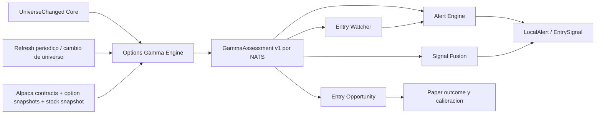

# Gamma Engine para MarketBot

Estado: implementado en la definicion `7.6.0`, con scoring tactico acotado en Alert y Signal Fusion.

## Objetivo

Agregar un engine independiente que obtenga exclusivamente desde Alpaca la cadena de opciones y
el precio spot de cada simbolo del universo Core, calcule niveles gamma por vencimiento y publique
un contexto estable por NATS. Los engines de decision pueden usar ese contexto como evidencia
tactica acotada, sin importar la implementacion del Gamma Engine ni consultar Alpaca directamente.

El engine no pronostica un precio final exacto. Produce zonas, regimenes y escenarios con calidad
explicita. La direccion y la madurez de compra siguen perteneciendo a Alert, Entry Watcher y
Signal Fusion.

## Decisiones de arquitectura

1. Gamma es un engine productor independiente bajo `app/options_gamma_engine/`.
2. Alpaca es su unica fuente de mercado: contratos, snapshots de opciones y snapshot del subyacente.
3. El universo es el Core dinamico: watchlist activa mas holdings positivos.
4. La comunicacion entre Gamma y los consumidores ocurre solo mediante contratos estables y NATS.
5. Se publica un snapshot completo por simbolo; el vencimiento se modela en el payload y no en el
   subject, para que `get_last` hidrate todo el contexto vigente con una sola lectura.
6. Gamma no emite `EntrySignal`, `LocalAlert`, ordenes, sizing ni madurez L1-L4.
7. Max pain, gamma wall y gamma flip son niveles de contexto, no targets garantizados.
8. El productor opera como proceso `active` headless, refresca el universo en background y tambien
   admite una corrida `--once` de diagnostico. Los consumidores fallan abierto ante ausencia,
   baja calidad o vencimiento del contexto.

## Flujo propuesto



## Contrato NATS

Evento:

```text
options-gamma.assessed
```

Subject:

```text
marketbot.v1.options-gamma.assessment.<SYMBOL>
```

El payload `GammaAssessment` debe ser un `StrictFrozenModel`, usar `Decimal` para importes y scores,
timestamps UTC conscientes de zona y mantener compatibilidad aditiva v1.

JetStream conserva el ultimo evento, pero la retencion no define su vigencia analitica. Cada
assessment incluye `expires_at`; un consumidor puede hidratarlo con `get_last`, aunque debe
descartarlo para scoring cuando este vencido.

Campos minimos:

| Grupo | Campos |
| --- | --- |
| Identidad | assessment_id, symbol, engine_version, strategy_version, generated_at |
| Ventana | expiration_from, expiration_to, nearest_expiration, days_forward |
| Frescura | spot_as_of, chain_as_of, open_interest_as_of, expires_at |
| Cobertura | contract_count, usable_contract_count, coverage_ratio, warnings |
| Spot | spot_price |
| Regimen | gamma_regime, net_gamma_exposure, absolute_gamma_exposure, net_gamma_ratio |
| Niveles agregados | call_wall, put_wall, absolute_gamma_wall, max_pain, gamma_flip |
| Distancias | distancia porcentual de spot a cada nivel |
| Escenario | expected_move_low, expected_move_high, directional_bias, pin_risk, acceleration_risk |
| Calidad | quality_score, dealer_sign_assumption, stale, incomplete_chain |
| Vencimientos | tuple de `GammaExpirationAssessment` |
| Auditoria | source_event_ids, context_hash, methodology_version |

Cada `GammaExpirationAssessment` contiene como minimo fecha, DTE, open interest, GEX neto y absoluto,
call wall, put wall, max pain, gamma flip estimado, expected move y un `influence_weight` normalizado.

No se deben transportar todos los contratos individuales por JetStream. El engine conserva la
cadena cruda durante el calculo y publica agregados por strike/vencimiento mas los niveles top
necesarios para auditoria. Esto limita tamano, retencion y acoplamiento.

## Calculo v1

La idea de `stock-analyzer` se reutiliza conceptualmente, pero se implementa con contratos y
aritmetica `Decimal` propios de MarketBot.

Para cada contrato utilizable:

```text
GEX_1pct = gamma * open_interest * 100 * spot^2 * 0.01
```

Convencion inicial:

```text
calls = +GEX
puts  = -GEX
```

Esta convencion estima el signo del dealer y debe declararse en el resultado. No se conoce la
posicion real de cada participante; por eso el signo nunca puede actuar como gate duro por si solo.

Niveles:

| Nivel | Definicion v1 | Uso |
| --- | --- | --- |
| Call wall | strike con mayor GEX positivo de calls | resistencia/magneto superior potencial |
| Put wall | strike con mayor magnitud de GEX de puts | soporte/magneto inferior potencial |
| Absolute gamma wall | strike con mayor GEX absoluto combinado | zona de mayor sensibilidad de cobertura |
| Max pain | strike que minimiza payout agregado al vencimiento | referencia de pin, nunca target garantizado |
| Gamma flip | cruce de cero del GEX neto al recalcular gamma sobre una grilla de spots | frontera de regimen estimada |
| Expected move | ATM straddle o fallback por IV y tiempo | rango, no direccion |

El gamma flip no debe copiar el cruce entre buckets de strikes de `stock-analyzer`. Para MarketBot
se recalcula Black-Scholes gamma sobre una grilla de precios hipoteticos, manteniendo OI e IV del
snapshot. Esto aproxima mejor el punto donde cambia el regimen agregado.

La influencia de cada vencimiento se calcula por separado. La vista agregada usa un peso acotado
por GEX absoluto, OI, calidad y cercania temporal; no mezcla vencimientos como si tuvieran el mismo
impacto. Deben exponerse, al menos, nearest/0DTE, hasta 7 DTE y hasta 45 DTE cuando existan.

## Punto 1: reglas de entrada y salida

Gamma no crea entradas. Entrega evidencia para que el engine propietario de la decision aplique
estas reglas junto con estructura, tendencia, volumen y confirmacion.

### Regimen positivo o mixto

| Situacion | Interpretacion tactica |
| --- | --- |
| Precio dentro del expected move y cerca de put wall/soporte | candidato a rebote si Swing o Intraday confirman reclaim |
| Precio cerca de max pain o absolute wall antes de expiry | riesgo de pin/chop; penaliza persecucion y reduce conviccion |
| Entrada debajo de call wall con poco espacio | menor reward/risk; usar wall como primer take-profit o no entrar |
| Ruptura limpia de call wall con volumen | Gamma no confirma breakout por si solo; deja de penalizar si el Core confirma |

### Regimen negativo

| Situacion | Interpretacion tactica |
| --- | --- |
| Precio pierde put wall o gamma flip | riesgo de aceleracion bajista; penalizacion y/o invalidacion mas estricta |
| Precio supera call wall o gamma flip con confirmacion | posible aceleracion alcista; boost acotado, nunca compra autonoma |
| Precio se aproxima a un nivel sin confirmacion | no hacer fade mecanico; exigir reclaim, volumen o estructura |

### Niveles operativos derivados

El consumidor puede derivar:

```text
entry_zone = interseccion de zona Core con put wall / gamma flip / max pain relevante
invalidation = invalidacion Core; Gamma solo puede hacerla mas conservadora, nunca ampliarla
take_profit_1 = primer call wall o max pain alineado por encima de entry
take_profit_2 = limite superior del expected move si el Core tiene continuidad
avoid_chase_above = nivel donde queda poco reward/risk hasta la proxima barrera gamma
```

Si no existe interseccion con niveles tecnicos independientes, Gamma no inventa una entrada.

## Punto 2: integracion de scoring

El scoring se aplica en el consumidor y se registra como componente separado. No se modifica el
`score` original de Long, Swing o Intraday.

### Quality gate

No se aplica ningun boost cuando ocurre cualquiera de estas condiciones:

- `quality_score < 70`.
- Cadena incompleta o `coverage_ratio < 0.70`.
- Open interest sin fecha o demasiado antiguo.
- Spot o snapshots vencidos segun `expires_at`.
- Menos de un vencimiento utilizable.

Un contexto degradado puede agregar una razon informativa, pero su modificador es cero.

### Modificadores iniciales shadow

| Consumidor | Rango propuesto | Responsabilidad |
| --- | ---: | --- |
| Alert | -10 a +8 | timing, pin/chase risk y alineacion de entry/target |
| Entry Watcher | -8 a +5 | armar, mantener o endurecer una tesis; nunca relajar invalidacion |
| Signal Fusion | -8 a +6 | evidencia independiente acotada, sin reemplazar gates estructurales |
| Entry Opportunity | 0 | persiste contexto y mide outcome; no redefine la compra |
| Long | 0 | Gamma es tactico y no cambia la tesis de largo plazo |
| Swing / Intraday productores | 0 | no consumen Gamma; conservan independencia de evidencia |

Reglas de ejemplo para calibrar en shadow:

| Evidencia | Delta candidato |
| --- | ---: |
| Entry Core dentro de 1% de put wall y reclaim confirmado | +4 |
| Call wall deja reward/risk >= 2 y coincide con target Core | +3 |
| Breakout Core confirmado en regimen negativo sobre gamma flip | +3 |
| Spot a menos de 1% de max pain con pin risk | -4 |
| Menos de 1R hasta call wall relevante | -6 |
| Perdida de put wall/gamma flip en regimen negativo | -8 |
| Gamma contradice Core pero sin calidad suficiente | 0 y razon informativa |

El modificador total se satura al rango del consumidor y debe aparecer en `reasons`, metricas y
auditoria. Gamma no puede promover por si solo L1 a L2, L2 a L3 ni crear L4.

## Proyeccion por vencimiento

La salida para responder "donde puede concluir el precio" debe llamarse escenario de convergencia,
no forecast puntual. Por vencimiento incluye:

```text
expected_range
magnet_levels
barrier_levels
invalidation_levels
pin_risk
acceleration_risk
influence_weight
```

En v1, `directional_bias` puede ser `UP`, `DOWN`, `NEUTRAL` o `UNRELIABLE`. No se publican
probabilidades de cierre hasta calibrarlas con snapshots historicos sin look-ahead. Luego del
backtest se puede agregar en forma compatible `close_below`, `close_inside` y `close_above` con
probabilidades calibradas y `calibration_sample_size`.

## Estabilidad y frescura

| Dato | Estabilidad esperada | Politica operativa |
| --- | --- | --- |
| Open interest | normalmente cambia por ciclo diario y trae `open_interest_as_of` | reutilizable mientras la fecha de OI sea explicita |
| Max pain | relativamente estable; cambia si cambia OI o la ventana de expiries | contexto intradia con fecha de OI explicita |
| Call/put wall por OI | relativamente estable | contexto diario |
| GEX y absolute gamma wall | intradia; depende de spot, IV y gamma vigente | refrescar antes de una decision tactica |
| Gamma flip | intradia y sensible al modelo | exigir snapshot reciente |
| Expected move | intradia; cambia con primas, IV y tiempo restante | exigir snapshot reciente |
| Distancia de spot a niveles | cambia con cada movimiento del subyacente | recalcular o invalidar rapido |
| 0DTE | muy dinamico, especialmente cerca del cierre | TTL corto y refresh automatico |

TTL inicial sugerido durante mercado regular:

| Ventana dominante | `expires_at` sugerido |
| --- | ---: |
| 0DTE | 5 minutos |
| 1 a 7 DTE | 20 minutos |
| 8 a 45 DTE | 60 minutos |

Estos TTL son politica inicial, no una propiedad del mercado. Deben calibrarse y pueden acortarse
si spot se mueve mas de 1% desde `spot_price` aunque el tiempo todavia no haya vencido.

## Ciclo operativo activo

Comando headless continuo:

```powershell
uv run marketbot engine options-gamma
```

Para una corrida puntual de diagnostico:

```powershell
uv run marketbot engine options-gamma --symbols AAPL,MSFT,NVDA --once
```

1. Al iniciar, cargar una foto del universo Core desde PostgreSQL o usar los simbolos explicitos.
2. Consultar Alpaca por simbolo con concurrencia limitada cada
   `MARKETBOT_OPTIONS_GAMMA_REFRESH_SECONDS` y cuando cambia el universo.
3. Publicar un `GammaAssessment` rico y su proyeccion `AnalysisResult(OPTIONS_GAMMA)` por simbolo.
4. Los consumidores hidratan `get_last` al iniciar y escuchan nuevas publicaciones mientras viven.
5. Los consumidores verifican `expires_at` y el movimiento de spot antes de aplicar el contexto.
6. Escribir readiness luego del primer refresh y aislar errores Alpaca por simbolo.
7. Fallar abierto para los consumidores: si Gamma no existe o esta stale, MarketBot continua con score
   gamma cero y deja trazabilidad de contexto no disponible.

Con `--once`, el proceso publica una vez, imprime el resumen y finaliza. Sin esa opcion permanece
activo; el valor por defecto de refresh es 10 minutos.

## Integracion al assembly

La implementacion vive en la nueva definicion inmutable `7.6.0`; no modifica `7.5.0`. El slot
`options-gamma` se registra en modo `active`, con implementacion y estrategia `1.0.0`.

Cambios previstos:

| Area | Cambio |
| --- | --- |
| `app/contracts/` | `GammaAssessment`, evento, subject y tests de contrato |
| `app/options_gamma_engine/` | modelos privados, pricing, calculo, engine, tests y README |
| `app/alpaca_market_data/` | puerto/adaptador de contracts y option snapshots, sin logica gamma |
| `app/integration/` | composition NATS, catalogo, assembly, runtime process plan y tests |
| `configs/marketbot/` | definicion `7.6.0` con slot `options-gamma` en modo active |
| `app/alert_engine/` | Alert 3.5 aplica modificador gamma acotado y auditable |
| `app/entry_watcher/` | recibe contexto gamma opcional sin permitirle definir el precio actual |
| `app/signal_fusion_engine/` | contexto gamma opcional y boost/penalty acotado |
| `app/entry_opportunity_engine/` | snapshot gamma en evidencia para medicion, delta cero |
| `docs/` | arquitectura, mapa de interconexion y operacion |

## Entregas

### Fase A: productor activo

- Contrato, adapter Alpaca, calculo, composition, NATS y health.
- Proceso headless para universo Core o lista explicita de simbolos.
- Refresh periodico y reaccion a `UniverseChanged`.
- Publicacion dual del assessment rico y del analisis estandar.

### Fase B: medicion

- Adjuntar el assessment vigente a nuevas paper opportunities.
- Registrar outcome por vencimiento, distancia a niveles, MAE/MFE y cierre dentro/fuera del rango.
- Ejecutar replay sin look-ahead y medir por ticker, DTE, regimen y calidad.

### Fase C: consumidores acotados

- Alert 3.5 y Signal Fusion 0.5 aplican deltas limitados sin cambiar gates ni estados.
- Entry Watcher conserva el analisis fresco como contexto, pero Gamma no arma entradas por si solo.

### Fase D: calibracion y activacion ampliada

- Medir penalizaciones y boosts por DTE, regimen, ticker y calidad.
- Promover nuevas reglas solo mediante otra estrategia y definicion inmutables.
- Mantener rollback seleccionando la definicion anterior.
- Ajustar frecuencia y TTL segun costo, cobertura y estabilidad observada.

## Criterios de aceptacion

- Un engine caido no bloquea Long, Swing, Intraday, Alert ni el market stream.
- Cada assessment es idempotente, versionado, reproducible y trazable a su snapshot.
- Ningun consumidor importa `app/options_gamma_engine`.
- Ningun resultado Gamma crea una orden o una madurez L1-L4 por si mismo.
- Max pain y walls siempre incluyen vencimiento, frescura, cobertura y calidad.
- Tests unitarios no requieren Alpaca, PostgreSQL ni NATS.
- Integracion NATS queda marcada como test de integracion.
- Antes de activar scoring se presenta evidencia de replay sin look-ahead.
